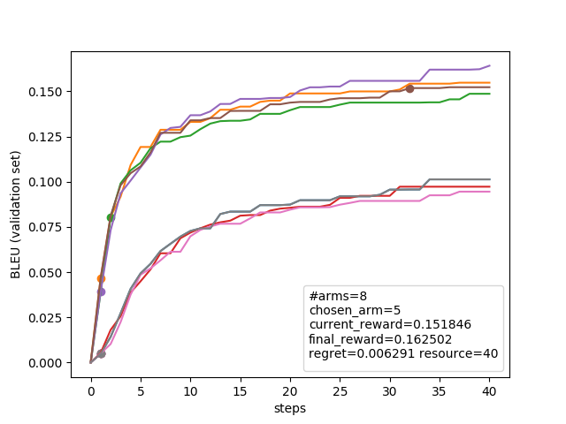
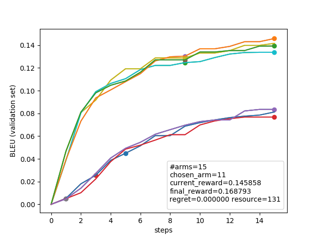

# Hyperband Simulation for Hyperparameter Optimization

### Introduction
This is a collection of scripts for experimenting with bandit-style problems in hyperparameter optimization. Each arm in the bandit problem corresponds to a neural model, and a pull on the arm corresponds to training the model for a single iteration/checkpoint. The goal is to find the model with the best hyperparameters with as few resources (i.e. few arm pulls) as possible.

The Hyperband algorithm and several other conventional K-arm bandit methods are implemented. To run the simulation quickly without the costly process of training models for real, we assume that a set of models are already trained to completion and logged. The simulator simply "replays" the learning curve. 

### Data directory and Pre-requisites
The `data/` directory contains a set of training log files from the <a href="https://github.com/awslabs/sockeye">Amazon Sockeye</a> Neural Machine Translation toolkit. In particular, we use the `metrics` training log file from the Sockeye training procedure and extracts the BLEU learning curve on the validation set (`bleu-val`). Note for BLEU scores, the higher the better. As long as you have a collection of Sockeye `metrics` files, you can run the hyperparameter optimization simulation.

It should be relatively easy to extend the code to read training logs from other frameworks, or to optimize on perplexity rather than BLEU. We leave that as future work.

The code is tested with Python 2.7. The only requirements are numpy and matplotlib.

### K-Arm Bandit Algorithms

To run conventional <b>k-arm bandit</b> algorithms:
```
python bandit_simulation.py -d data/wmt18-zh-en -k 8 -b 40 -p
```

 * `-d` specifies the data directory. As the output below shows, 7 metrics files are found by recursively searching the specified directory for `metrics` files.
 * `-k` specifies the number of arms/models in this simulation. If the number of models required is more than the actual number of metrics files, the simulator will automatically re-sample to reach the right number.
 * `-b` is the budget. In this example, the bandit algorithm stops after 40 pulls/checkpoints/iterations are used in total.
 * `-p` is optional and when specified, generates a plot of the simulation (`tmp.png`)
 * `-a` is an optional algorithm specifier. By default we use the Epsilon-Greedy algorithm.
 * `-r` is optional and when specified, randomizes the sampling of the arms/models to test different instances of the simulation. (default is False, i.e. don't randomize)

Here is the output:

```
Found 7 metrics files in data/wmt18-zh-en
oracle arm=4, oracle reward=0.168793
...
---- Simuluation results ----
=== Multi-Arm experiment status ===
id current_step max_step current_reward final_reward name
0 1 64 0.004846 0.102910 0:data/wmt18-zh-en/70000-70000/100-100-100-dot-1-lstm-.0/metrics
1 1 69 0.046537 0.166887 1:data/wmt18-zh-en/30000-50000/500-500-500-dot-2-lstm-.1/metrics
2 1 77 0.038905 0.158700 2:data/wmt18-zh-en/30000-50000/500-500-500-dot-1-lstm-.1/metrics
3 1 95 0.005304 0.101622 3:data/wmt18-zh-en/50000-50000/100-100-100-dot-1-lstm-.0/metrics
4 1 70 0.039294 0.168793 4:data/wmt18-zh-en/50000-50000/500-500-500-dot-2-lstm-.1/metrics
5 32 77 0.151846 0.162502 5:data/wmt18-zh-en/50000-50000/500-500-500-dot-1-lstm-.1/metrics
6 2 79 0.010215 0.100577 6:data/wmt18-zh-en/30000-30000/100-100-100-dot-1-lstm-.0/metrics
7 1 64 0.004846 0.102910 0:data/wmt18-zh-en/70000-70000/100-100-100-dot-1-lstm-.0/metrics
chosen_arm=5 final_reward=0.162502 oracle=0.168793 regret=0.006291 resource=40 num_arms_examined=8
```

The simulation result shows a table of representing the state of the 8 arms (id=0..7). Note that id=0 and id=7 are the same metric file `0:data/.../metrics` due to re-sampling. The oracle arm is id=4, has final reward (BLEU) of 0.168793. We have chosen arm id=5, pulling it for 32 checkpoints (current_step); it has a final reward of 0.162502, so our regret is 0.006291. This is not too bad, considering we only used a budget of 40 pulls (resource); if we had trained all 8 models for 32 checkpoints each, that would have cost 8x32=256 steps in aggregate. 

Here's a plot of the bandit simulation. We observe 8 BLEU curves (id=0, id=7 are overlapped). The dots show the stopping point of each arm. Note that the curves are monotonically-increasing; we don't use the raw BLEU curve, but instead use a smoother version that takes the best BLEU up to the current step. i.e. curve[step] = max\_{i=0,1,..,step}(rawBLEU[i]). This is more in line with the goals of model selection in hyperparameter search.



### The Hyperband Algorithm

Hyperband is an efficient alternative for bandit-style hyperpameter selection. Rather than pulling one arm at a time, the idea is to pull multiple arms in parallel and then successively prune half of them at set intervals. This is called Successive Halving and is the inner loop of Hyperband (In practice, we don't necessarily prune half of the models; the fraction is specified by the parameter `eta`). Assuming a fixed budget for Successive Halving, there is a tradeoff between how many models to run in parallel (n) vs how many iterations to train before starting to prune (r). Hyperband simply uses an outerloop of different (n,r) settings, and in practice this has proven quite robust. 

The only parameter that needs to be set for Hyperband is max\_iter (`-i`), which specifies the maximum number of iterations/checkpoints you think a "good" model should be trained for. In other words, if you think 100 iterations can give you a reasonable validation BLEU such that you can deploy the model, then set max\_iter (`-i`) to 100. Hyperband will automatically adjust its search such that at least some models will be trained up to 100 iterations in each Successive Halving procedure. 

Note that Hyperband does not have a budget parameter like `-b` in `bandit_simulation.py`. Setting max\_iter (`-i`) and eta (`-e`) will automatically determine the various (n,r) settings, which subsequently determine the budget. It's a different way to approach hyperparameter search: rather than restricting to a fixed total budget, Hyperband restricts to a fixed max\_iter to ensure that some of the models are good. 


See the author's <a href="https://people.eecs.berkeley.edu/~kjamieson/hyperband.html">blog post</a> and papers therein for more information. 

To run the <b>Hyperband</b> algorithm:
```
python hyperband_simulation.py -d data/wmt18-zh-en -i 15 -p
```

 * `-d` specifies the data directory. As the output below shows, 7 metrics files are found by recursively searching the specified directory. 
 * `-i` specifies the max number of iterations (max\_iter) we want to train a model. This is the main parameter and should be set to a value that will result in a reasonably good model. The wording max\_iter is a bit nuanced: think of it as the "minimum" number of iterations one is confident of to train a reasonable model, and to guarantee good results, Hyperband will run some models <em>up to this number and no more</em> (thus "max\_iter"). From the learning curve plot in the bandit experiment above, we observe that models start converging after 15 checkpoints. So let's set `-i 15`.
 * `-e` is the eta paramater in Hyperband's Successive Halving inner loop: 1/eta of the models will survive from pruning. The default is eta=3. eta=2 seems effective too. This should be an integer.
 * `-p` is optional and when specified, generates a plot of the simulation (`tmp.png`)
 * `-r` is optional and when specified, randomizes the sampling of the arms/models to test different instances of the simulation. (default is False, i.e. don't randomize)


Here is the output:

```
Found 7 metrics files in data/wmt18-zh-en
oracle arm=4, oracle reward=0.168793

---- Hyperband starting ----
Successive halving bracket s=2: total arms n=9, min step r=1
  n_i=9 arms, evaluated 1 steps (current_step r_i=1), innerloop_resource=9
  n_i=3 arms, evaluated 2 steps (current_step r_i=3), innerloop_resource=21
  n_i=1 arms, evaluated 6 steps (current_step r_i=9), innerloop_resource=51
Successive halving bracket s=1: total arms n=3, min step r=5
  n_i=3 arms, evaluated 5 steps (current_step r_i=5), innerloop_resource=15
  n_i=1 arms, evaluated 10 steps (current_step r_i=15), innerloop_resource=35
Successive halving bracket s=0: total arms n=3, min step r=15
  n_i=3 arms, evaluated 15 steps (current_step r_i=15), innerloop_resource=45
Total resource usage: 131

---- Simuluation results ----
=== Multi-Arm experiment status ===
id current_step max_step current_reward final_reward name
0 1 64 0.004846 0.102910 0:data/wmt18-zh-en/70000-70000/100-100-100-dot-1-lstm-.0/metrics
1 9 69 0.128772 0.166887 1:data/wmt18-zh-en/30000-50000/500-500-500-dot-2-lstm-.1/metrics
2 9 77 0.124688 0.158700 2:data/wmt18-zh-en/30000-50000/500-500-500-dot-1-lstm-.1/metrics
3 3 95 0.025591 0.101622 3:data/wmt18-zh-en/50000-50000/100-100-100-dot-1-lstm-.0/metrics
4 9 70 0.130393 0.168793 4:data/wmt18-zh-en/50000-50000/500-500-500-dot-2-lstm-.1/metrics
5 9 77 0.127103 0.162502 5:data/wmt18-zh-en/50000-50000/500-500-500-dot-1-lstm-.1/metrics
6 1 79 0.005036 0.100577 6:data/wmt18-zh-en/30000-30000/100-100-100-dot-1-lstm-.0/metrics
7 1 64 0.004846 0.102910 0:data/wmt18-zh-en/70000-70000/100-100-100-dot-1-lstm-.0/metrics
8 9 69 0.128772 0.166887 1:data/wmt18-zh-en/30000-50000/500-500-500-dot-2-lstm-.1/metrics
9 15 77 0.133766 0.158700 2:data/wmt18-zh-en/30000-50000/500-500-500-dot-1-lstm-.1/metrics
10 5 95 0.044929 0.101622 3:data/wmt18-zh-en/50000-50000/100-100-100-dot-1-lstm-.0/metrics
11 15 70 0.145858 0.168793 4:data/wmt18-zh-en/50000-50000/500-500-500-dot-2-lstm-.1/metrics
12 15 77 0.139244 0.162502 5:data/wmt18-zh-en/50000-50000/500-500-500-dot-1-lstm-.1/metrics
13 15 79 0.076785 0.100577 6:data/wmt18-zh-en/30000-30000/100-100-100-dot-1-lstm-.0/metrics
14 15 64 0.083490 0.102910 0:data/wmt18-zh-en/70000-70000/100-100-100-dot-1-lstm-.0/metrics
chosen_arm=11 final_reward=0.168793 oracle=0.168793 regret=0.000000 resource=131 num_arms_examined=15
```

Let's go through the output in detail, to understand what Hyperband is doing. We see that Hyperband started 3 Successive Halving inner loops. In the first case (`bracket s=2`), n=9 models are trained in parallel, and pruning starts after r=1 iteration. After these 9 models are trained for 1 step/iteration, 1/3 of them survived and is trained for another 2 steps (`n_i=3 arms, evaluated 2 steps`). Finally, 1/3 of them survived and is trained for another 6 steps (`n_i=1 arms, evaluated 6 steps`). In the second Successive Halving loop (`bracket s=1`), we start with 3 models and train them for 5 steps before pruning (`... total arms n=3, min step r=5`). 1/3 of them (i.e. 1 of them) survived and is trained for another 10 steps (`n_i=1 arms, evaluated 10 steps`), reaching the desired `max_iter=15`. In the third and final Successive Halving loop (`bracket s=0`), 3 models are trained to 15 steps directly without any pruning.

The final simulation results show that Hyperband has generated 15 models (id=0 to id=14), and chose an model/arm whose eventual BLEU score (final reward) matches that of the oracle. If one were to train 15 models each for 15 iterations, that would require 15x15=225 resources. Hyperband in this case spent only 131 resources (checkpoints). No regrets! 

Here's a plot of the hyperband simulation. 



### Larger-scale Experiments

The data directory in the above examples (`data/wmt18-zh-en`) had only a few models, so is only suitable as illustration. For larger-scale experiments that really test the performance of bandit and hyperband algorithms, we recommend using `data/ted-zh-en` which has 101 models. 

Try using the randomized flag `-r` for multiple trials:

```
for trial in `seq 1 10` ; do 
  python hyperband_simulation.py -d data/ted-zh-en/ -i 30 -r | tail -2 ; 
done
```

Here is an example output (summarized):

```
...
regret=0.000000 resource=818 num_arms_examined=46
regret=0.004158 resource=818 num_arms_examined=46
regret=0.004158 resource=818 num_arms_examined=46
regret=0.002808 resource=818 num_arms_examined=46
regret=0.004158 resource=818 num_arms_examined=46
regret=0.000000 resource=818 num_arms_examined=46
regret=0.004158 resource=818 num_arms_examined=46
regret=0.004158 resource=818 num_arms_examined=46
regret=0.004158 resource=818 num_arms_examined=46
regret=0.002808 resource=818 num_arms_examined=46
```

We see regret is between 0-0.004 BLEU difference, which is miniscule. The number of arms examined by Hyperband is 46. If we were to train 46 models each up to `-i 30` iterations, that would take 46x30=1380 resources. In this case, Hyperband only used 818 resources (training iterations) in total, a 40% saving. 

---

### Acknowledgments

This work is supported by an Amazon Research Award. Thanks! 

For questions, please contact <a href="http://www.cs.jhu.edu/~kevinduh/">Kevin Duh</a> or post an issue. 